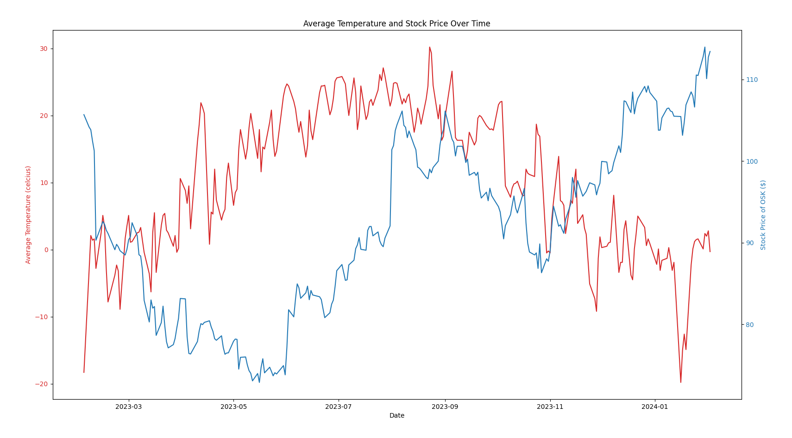

<h1 align='center'>Sky Market Trends</h1>
<h4 align='center'>Uncovering the relationship between Weather and the Oshkosh Corporation</h4>
<br>

<!-- Video walkthrough or image -->


<br>

<!-- List links to the project here (eg: live-link, youtube video) -->
- **Demonstration Video: coming soon...**


<!-- ABOUT THE PROJECT -->
## About

This data engineering project aims to uncover the relationship between weather conditions and 
the stock price of the Oshkosh Corporation. The Oshkosh corporation is a company that designs and builds specialty trucks, military vehicles, truck bodies, airport fire apparatus, and access equipment headquartered in Oshkosh, Wisconsin. 

Due to their relationship with speciality vehicles, I hypothesized that their stock price would be affected by weather conditions. For example, if there is a snowstorm, then the stock price would increase due to higher demand of speciality snow vehicles (eg: Snow plows).



### Use Case

This project is useful for data scientists looking to learn more about the relationship between weather and the Oshkosh Corporation. 
Perhaps they can use this information to make better predictions on what products to invest in or how to allocate marketing resources during certain weather conditions.

### Why Did I Build it

To be completely honest, I have a data engineering intern interview coming up and I wanted to build a project that would help me learn more about data engineering. The position is with the Oshkosh corporation so I thought it would be a great starting point in learning how to build a data pipeline and relating it back to my interview.

## Features

- **Data Collection**: Automated processes to fetch historical weather data and OSK stock prices from reputable APIs (WeatherBit, AlphaVantage).
- **ETL Pipeline**: Using python, I stored the data into an SQLite database, then used Docker to containerize the database, and finally used Airflow to automate the ETL process.
- **Data Analysis**: My analysis compared the correlation between average temperature and OSK stock performance. Findings here...
- **Visualization**: Using MatPlotLib, I created visualizations to help me understand the relationship between weather and OSK stock performance.

### Built With

- Python3
- SQLite
- Docker
- Airflow
- MatPlotLib
- Pandas

<!-- USAGE EXAMPLES -->
## Getting Started

### Prerequisites
- Python3
- Docker (optional for container deployment)
- API keys for accessing weather and financial data

### Installation

1. Clone the repository

```sh
git clone git@github.com:dave-cao/Sky-Market-Trends.git
```

2. cd into the project directory

```sh
cd Sky-Market-Trends
```

3. Option 1: Using Docker

```sh
docker-compose up init-airflow
docker-compose up
```
- Now you can access the Airflow UI at `localhost:8080` (default login: airflow, password: airflow)

4. Option 2: Using Python

```python
pip install -r requirements.txt

# Run the ETL script
python3 etl_script.py

# Get the chart
python3 plot.py
```

<!-- List at least 3 things that you found challenging -->
## Notes

Quite a challenging project to work on. I had to learn a lot about Docker, Airflow, and how to use APIs to fetch data. 
I think the hardest part for me was figuring out how to use Airflow to automate the ETL process. I had to learn how to use the Airflow UI, how to write DAGs, and how to use the Airflow CLI. At the end when I **finally** got it to work with Docker, it gave me an error! It turns out, I had to rewrite the permissions to let 
Airflow access the SQLite database.


<!-- ROADMAP -->
## Roadmap

Currently I have no plans to continue working on this project. I have learned a lot from it and I am ready to move on to the next project.

<!-- CONTRIBUTING -->
## Contributing

Contributions are what make the open source community such an amazing place to learn, inspire, and create. Any contributions you make are **greatly appreciated**.

If you have a suggestion that would make this better, please fork the repo and create a pull request. You can also simply open an issue with the tag "enhancement".
Don't forget to give the project a star! Thanks again!

1. Fork the Project
2. Create your Feature Branch (`git checkout -b feature/AmazingFeature`)
3. Commit your Changes (`git commit -m 'Add some AmazingFeature'`)
4. Push to the Branch (`git push origin feature/AmazingFeature`)
5. Open a Pull Request


<!-- CONTACT -->
## Contact

#### David Cao
- Email: sirdavidcao@gmail.com
- Personal Website: https://davidcao.xyz/
- [Other Projects](https://davidcao.xyz/legacy-portfolio/ProjectsPage/index.html)
- [Youtube](https://www.youtube.com/channel/UCEnBPbnNnqhQIIhW1uLXrLA)
- [Linkedin](https://www.linkedin.com/in/david-cao99/)
